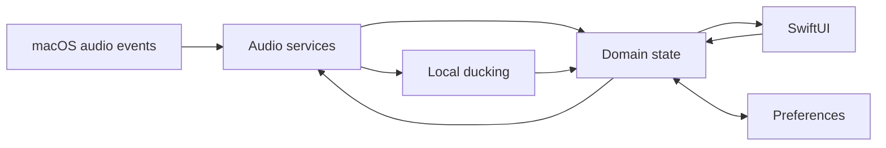

# Lamun Architecture

## Current Implementation

Phase -1 contains only the native Menu Bar bootstrap shell and engineering tooling. There is no audio discovery, capture, gain control, metering, ducking, persistence, profile, or rule implementation. The bootstrap SwiftUI scene and its project/test configuration are described in [DEVELOPMENT.md](./DEVELOPMENT.md).

## Provisional Direction

The intended boundaries are App lifecycle; SwiftUI Menu Bar and Settings; Audio services for process discovery, control, metering, and device lifecycle; Ducking for local detection and transitions; Domain state; Persistence; and System integrations for permissions, launch at login, and logging. See [PLAN.md](./PLAN.md#7-provisional-architecture-direction).

This is **not** an accepted production topology. Phase 0 must prove process discovery, capture, independent gain, routing, permissions, sandbox behavior, lifecycle, performance, and distribution before module or concurrency decisions become final. SwiftUI views must not own low-level audio resources. Audio callbacks must avoid blocking and disk I/O.

## State and Data Flow

No production audio state currently exists. The desired direction is audio services → domain state → observable UI state, with user commands flowing back through domain/service boundaries. Preferred volume and effective volume must have clear ownership, and manual actions must override automation. Persistence policy follows tested process identity and lifecycle behavior.

## Permissions and System Integration

The bootstrap app requests no audio permission and has no audio entitlements. Phase 0 will document actual permissions, App Sandbox requirements, minimum macOS target, and distribution constraints. Optional Launch at Login is a Phase 1 feature.

## Decisions

No audio architecture ADR has been accepted. Use [decisions/](./decisions/) for future evidence-backed decisions, and update this document to describe the implemented architecture rather than a stale plan.
