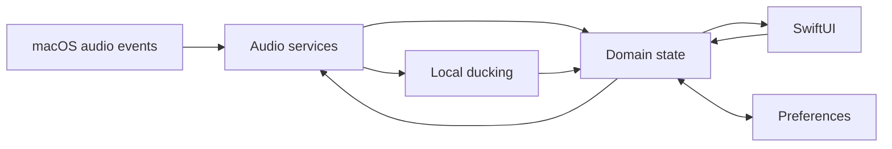

# Lamun Architecture

## Current Implementation

W002 adds a DEBUG-only process-discovery diagnostic on macOS 15 and later. `AudioProcessDiscovery` listens to Core Audio process-list and per-process output-state properties and emits copied `AudioProcessSnapshot` values; the diagnostic view resolves optional process metadata through `NSRunningApplication`. This prototype reads no audio samples. The tested output-state property identifies active output streams, not whether a stream currently carries audible samples. Its Core Audio Swift wrapper is unavailable below macOS 15 while Lamun's provisional deployment target remains 14.2. See [ADR-001](./decisions/ADR-001-process-discovery-prototype.md) and [W002 findings](./work/002-audio-process-discovery.md).

W003 has demonstrated a DEBUG-only process-tap topology on one host: one private aggregate per target includes the tap and the selected physical output, and a HAL I/O callback applies normalized gain. Two process streams were independently scaled. This is a provisional Phase 0 result, not a production topology; Float32/two-channel assumptions, acoustic quality, device switching, failure recovery, app grouping, and Developer ID distribution remain unvalidated. See [ADR-002](./decisions/ADR-002-per-app-gain-architecture.md) and [W003](./work/003-per-app-gain-feasibility.md). The former separate capture and gain work items were consolidated in the [plan revision](./PLAN.md#1-purpose).

## Provisional Direction

The intended boundaries are App lifecycle; SwiftUI Menu Bar and Settings; Audio services for process discovery, control, metering, and device lifecycle; Ducking for local detection and transitions; Domain state; Persistence; and System integrations for permissions, launch at login, and logging. See [PLAN.md](./PLAN.md#7-provisional-architecture-direction).

This is **not** an accepted production topology. Phase 0 must prove process discovery, capture, independent gain, routing, permissions, sandbox behavior, lifecycle, performance, and distribution before module or concurrency decisions become final. SwiftUI views must not own low-level audio resources. Audio callbacks must avoid blocking and disk I/O.

## State and Data Flow

No production audio control state exists. The W002 diagnostic distinguishes HAL-connected process objects from their output-I/O status. PID and AudioObjectID are runtime instance identifiers; bundle ID is a useful application key when exposed, but browser helpers may report helper bundle IDs or no resolvable app metadata. The desired production direction remains audio services → domain state → observable UI state, with user commands flowing back through domain/service boundaries. Preferred volume and effective volume must have clear ownership, and manual actions must override automation. Persistence policy follows tested process identity and lifecycle behavior.

## Permissions and System Integration

The Release configuration remains on the bootstrap sandbox entitlement. The DEBUG-only W003 POC adds the audio-input entitlement and `NSAudioCaptureUsageDescription`; the user granted System Audio Recording access on the test host. No minimum macOS target or distribution configuration is finalized. Optional Launch at Login is a Phase 1 feature.

## Decisions

ADR-001 accepts only a bounded discovery prototype direction. ADR-002 provisionally selects a tap/aggregate/HAL callback topology for continued feasibility testing, not production. Use [decisions/](./decisions/) for evidence-backed ADRs, and update this document to describe implemented behavior rather than a stale plan.
