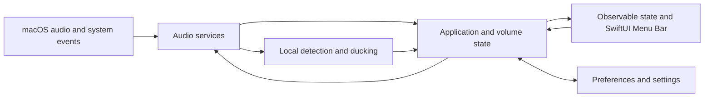
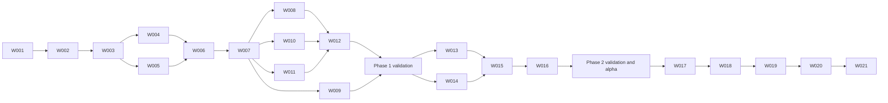

# Lamun Development Plan

## 1. Purpose

This is Lamun's execution roadmap. [PROMPT.md](./PROMPT.md) is the primary product and engineering specification; this plan turns it into ordered, reviewable work. Repository documentation must let a new Agent continue without access to any prior chat.

This plan describes intended work, not completed work. Phase 0 findings may require revisions before product implementation.

### Plan Revision — 1 October 2026

The original Phase 0 breakdown split process capture/permission feasibility into W003 and independent gain/routing into W004. Before W003 began, those items were consolidated into one **W003 — Independent Per-Application Gain Feasibility** gate because capture, original-output suppression, gain processing, rerendering, permissions, sandboxing, latency, and multi-app isolation must be evaluated together to judge the architecture. The former W004 gain item is superseded and has no separate implementation branch. Later Phase 0 work is re-scoped below; W007 and subsequent IDs remain unchanged.

## 2. Planning Principles

- **Documentation first:** Read the specification and current project documents, create the work document, define acceptance criteria and tests, then create the work branch and implement. Update the documents with findings and results before merge.
- **Skills first:** Inspect available Skills, discover relevant candidates with `find-skills` or an equivalent, evaluate them, and install selected Skills project-locally where supported.
- **Feasibility first:** Independent application gain is a hard gate. Do not build the production mixer around an unproven audio mechanism.
- **Focused changes:** Each work item has its own branch, work document, validation, Pull Request, CI run, and review-only Sub-agent review.
- **Integration and release:** `develop` is the buildable integration branch. `main` receives validated releases through a release Pull Request.
- **Native, public API, and privacy first:** Prefer Swift, SwiftUI, and supported Apple APIs. Process audio locally and retain no captured audio.

## 3. Current Repository State

At planning approval on 1 October 2026:

- Git existed, `main` was an unborn branch, `origin` was configured, and there were no commits or development branches.
- `docs/PROMPT.md` was present and untracked. An unrelated `.DS_Store` was also untracked.
- There was no Xcode project, application source, test target, dependency manifest, CI workflow, README, project Skill installation, ADR, work document, or other project documentation.
- No Lamun feature or engineering baseline had been implemented.
- The local machine had macOS 27.0 and Xcode 27.0. CI runner and deployment target compatibility still needed verification.

The starting point is **Phase -1 — Engineering Preparation**. The illustrative completed-status example inside `PROMPT.md` does not describe this repository. See [PROJECT-STATUS.md](./PROJECT-STATUS.md) for current status after execution begins.

## 4. Product Scope

### MVP

**Phase 1 delivers a useful mixer MVP:**

- Native macOS Menu Bar app showing relevant currently or recently audio-active applications, with name and icon where available.
- Independent effective volume and mute control for each compatible application, with immediate audible effect and no unintended change to another application.
- Subtle audio activity indication where feasible; documented preference persistence; compact Settings; optional Launch at Login.
- Graceful permission, application lifecycle, output-device, sleep/wake, and audio-error handling.

**Phase 2 completes the initial intelligent audio-focus MVP:**

- Optional, local Smart Ducking driven by user-selected compatible Trigger Sources and applied only to selected Duck Targets.
- Speech or relevant activity detection; smooth attack, hold, and release; original-volume preservation; predictable manual override; visible active state and settings.
- No recording, transcription, upload, or persistence of captured audio.

A browser may appear as one application. The exact supported application set follows Phase 0 evidence.

### Post-MVP

- **Phase 3:** Profiles for useful combinations of volume preferences and Smart Ducking configuration, based on observed MVP use.
- **Phase 4:** A bounded Trigger–Condition–Action audio-rules feature, introduced only when concrete use cases justify its model.

### Explicit Non-Goals

The initial MVP excludes browser-tab-level control, a professional equalizer, audio effects, spatial audio, recording, transcription, meeting summaries, cloud AI, audio streaming, a virtual microphone, DAW functionality, complex per-application output routing, and iOS or Windows apps. It also excludes a generic rules engine and profiles until their designated phases.

## 5. Technical Assumptions

**Confirmed specification and repository facts**

- Lamun is intended to be a native Swift/SwiftUI macOS Menu Bar utility.
- Independent application gain, privacy, predictable automation, and reliable lifecycle behavior are requirements.
- At planning approval, the repository had no implementation or accepted architecture decision.

**Supported starting point, not proof of Lamun's solution**

- Apple documents Core Audio process taps for capturing output from selected processes, with a sample requiring macOS 14.2 or later and a system-audio capture usage description and permission. This establishes an investigation path; it does **not** establish independent gain, acceptable latency, or a Lamun deployment target. See [Apple's Core Audio tap sample](https://developer.apple.com/documentation/coreaudio/capturing-system-audio-with-core-audio-taps).

**Provisional assumptions to verify in Phase 0**

- A public-API-based process discovery and gain path may support the required two-application demonstration.
- A stable app identifier such as a bundle identifier may support volume preferences, while process IDs remain transient.
- Process-level browser control may be the achievable MVP granularity.
- The production audio topology, minimum macOS version, sandbox mode, and distribution route are undecided.

## 6. Technical Unknowns

| Question | Evidence required before Phase 1 |
|---|---|
| Audio-producing process discovery | Identify active, recently active, terminated, and restarted applications; determine stable identity and notification behavior. |
| Process audio capture and Core Audio Process Taps | Verify API availability, stream isolation, formats, tap and aggregate-device lifecycle, errors, cleanup, and permission prompts. |
| Independent application gain and routing | Demonstrate A and B playing simultaneously; change each independently without affecting the other or system-wide volume. Determine whether capture and re-rendering, aggregate or virtual devices, or another supported method is necessary. |
| Minimum macOS version | Match the working API set and tested hardware to a justified deployment target; record an ADR. |
| Permissions, entitlements, and App Sandbox | Measure authorized, denied, and changed-permission behavior with intended signing and sandbox settings. |
| Mac App Store and direct distribution | Determine whether the chosen audio architecture can meet each channel's requirements; document signing and notarization implications. Apple requires App Sandbox for Mac App Store distribution; direct distribution has a separate Developer ID and notarization path. See [App Sandbox](https://developer.apple.com/documentation/security/app-sandbox/) and [macOS distribution guidance](https://developer.apple.com/documentation/xcode/preparing-your-app-for-distribution). |
| Device and process lifecycle | Test default-output changes, Bluetooth disconnect/reconnect, sleep/wake, process termination/restart, and stale-resource cleanup. |
| Performance and reliability | Measure added audio latency, CPU, memory, energy implications, UI responsiveness, and sustained operation. Set acceptance thresholds from the measured baseline before production integration. |
| Smart Ducking input | Prove that compatible Trigger Sources can provide isolated, timely audio frames or activity signals for local detection without retaining content. |
| Voice Activity Detection | Compare a simple local detector with Apple-supported analysis options using representative speech and non-speech; record accuracy, latency, and resource cost. |

If independent gain or the Smart Ducking input path fails, document the failure and revise the product or architecture through an ADR before entering the dependent phase.

## 7. Provisional Architecture Direction

Keep UI, domain behavior, low-level audio resources, automation, persistence, and system integration separate:



- **App:** Menu Bar lifecycle and dependency wiring.
- **UI:** Mixer and Settings; no direct ownership of Core Audio taps or devices.
- **Audio:** Discovery, verified gain/routing mechanism, metering, and device/resource lifecycle.
- **Ducking:** Local detection, deterministic state machine, transitions, and manual-override policy.
- **Domain:** Application identity, user intent, effective volume, and later profiles and rules.
- **Persistence:** Explicit preference policy using stable identity where valid.
- **System:** Permissions, Launch at Login, and privacy-safe logging.

Keep one authoritative account of user-preferred volume and effective output level. The concrete module layout, concurrency boundaries, and audio topology require Phase 0 decisions. Real-time callbacks must avoid blocking work and disk writes.

## 8. Development Phases

### Phase -1 — Engineering Preparation

- **Goal:** Establish a documented, buildable, testable native project and protected Git workflow before product code.
- **Work items:** W001. Seed the new repository; establish `main`, `develop`, and `feature/project-bootstrap`; initialize the Xcode app and test targets; inspect and discover Skills; create required docs, baseline tooling, GitHub Actions, PR template, and branch protection plan.
- **Required Skills:** Available `find-skills` and `skill-installer`; discover and verify suitable Swift/macOS, architecture, code quality, testing, security, and GitHub Actions Skills. Do not assume one exists.
- **Documentation:** `docs/work/001-project-bootstrap.md` before implementation; `README.md`, `PROJECT-RULES.md`, `PROJECT-STATUS.md`, `ARCHITECTURE.md`, `DEVELOPMENT.md`, `CONTRIBUTING.md`, `AGENT-SKILLS.md`, `SECURITY.md`, `TESTING.md`, `RISK-REGISTER.md`, and `docs/decisions/` during W001.
- **Expected branch:** `feature/project-bootstrap`.
- **Tests / validation:** Clean local and CI build; baseline test target; format, lint, documentation, static-analysis, and security checks appropriate to the initial project; verify commands documented in `DEVELOPMENT.md`.
- **Risks:** Unborn Git branch, unsupported CI runner/Xcode pairing, premature production bundle identifier, excessive bootstrap tooling.
- **Exit criteria:** Baseline builds and checks pass; required documents reflect reality; bootstrap PR passes CI and review-only Sub-agent review; required findings are fixed and checks rerun; merge to `develop`.

### Phase 0 — Technical Feasibility

- **Goal:** Replace audio and distribution assumptions with reproducible experiments and accepted decisions before production audio implementation.
- **Work items:** W002–W006: process discovery; combined capture, permission, sandbox, independent-gain and routing gate; extended lifecycle/endurance validation; Smart Ducking input feasibility; final architecture and minimum-OS gate.
- **Required Skills:** Verified Swift/macOS, Core Audio, architecture-review, test, security, and CI Skills where available.
- **Documentation:** One work document per item; W003 records the candidate comparison and reproducible gain measurements. Update `ARCHITECTURE.md`, `SECURITY.md`, `TESTING.md`, and `RISK-REGISTER.md` from evidence. Add ADRs for major audio architecture, minimum macOS, permission/sandbox/distribution, or input-pipeline decisions.
- **Expected branches:** `feature/audio-process-discovery`, `feature/per-app-gain-poc`, `feature/audio-reliability-poc`, `feature/ducking-input-poc`, `feature/audio-feasibility-decisions`.
- **Tests / validation:** Two-target independent audible gain and untargeted-app isolation; original-output suppression; permission and cleanup checks; device/process lifecycle; added-latency percentiles; CPU/memory/energy observations; local input-pipeline probe. Record hardware, OS, formats, and unavailable test conditions.
- **Risks:** Supported APIs may not deliver independent gain, acceptable latency, isolation, or intended distribution compatibility.
- **Exit criteria:** All Phase 0 questions have evidence or explicit blockers; W003 has an evidence-backed outcome and a credible Developer ID signed/notarized direct-distribution path is assessed; a production approach and minimum OS are justified; CI and reviews pass. A failed or conditional gain gate stops Phase 1 and triggers replanning.

### Phase 1 — Per-App Mixer

- **Goal:** Ship the useful mixer MVP described by AC-001 through AC-010 in `PROMPT.md`.
- **Work items:** W007–W012: production audio service; Menu Bar mixer; activity indication; preference persistence; device and permission recovery; basic Settings and Launch at Login.
- **Required Skills:** Verified native SwiftUI/macOS, Core Audio, accessibility, testing, performance, security, and review Skills where applicable.
- **Documentation:** Work document for each item; update architecture and ADRs as findings evolve; document preference-restoration policy, supported applications, manual test results, and known limits.
- **Expected branches:** `feature/audio-control-service`, `feature/menu-bar-mixer`, `feature/audio-activity`, `feature/volume-preferences`, `feature/audio-recovery`, `feature/settings-and-login`.
- **Tests / validation:** Independent gain and mute across two apps; live adjustment, termination/restart, persistence, device changes, permission denial, accessibility, privacy, UI responsiveness, and prolonged operation.
- **Risks:** Tap/resource leaks, surprising restoration, app identity errors, output gaps during switching.
- **Exit criteria:** All Phase 1 acceptance criteria pass on a documented macOS/device matrix; privacy and performance are acceptable; docs, CI, and review are complete.

### Phase 2 — Smart Ducking

- **Goal:** Add optional, predictable, private audio-focus behavior meeting AC-D01 through AC-D10.
- **Work items:** W013–W016: deterministic ducking and manual override; local speech/activity detection; integration with compatible sources and targets; Settings and active-state UI.
- **Required Skills:** Verified audio analysis, Swift concurrency, test, performance, security/privacy, and native UI Skills where available.
- **Documentation:** Work documents, a speech-detection ADR, documented trigger/target compatibility, thresholds and transition policy, manual-override policy, test recordings or scenarios without retained private user audio, and privacy verification.
- **Expected branches:** `feature/ducking-core`, `feature/local-speech-detection`, `feature/ducking-integration`, `feature/ducking-controls`.
- **Tests / validation:** State-machine unit tests; speech/non-speech and short-pause scenarios; source/target isolation; disable and manual override; device/lifecycle tests; measured latency and resource use; no captured-audio persistence or upload.
- **Risks:** False triggers, pumping, volume jumps, unavailable source isolation, excessive CPU.
- **Exit criteria:** Phase 2 acceptance criteria pass, and the full initial MVP is suitable for integration validation and an alpha release PR.

### Phase 3 — Profiles

- **Goal:** Add useful saved audio configurations after mixer and ducking behavior stabilizes.
- **Work items:** W017–W018: profile model/persistence, then profile selection and application.
- **Required Skills:** Verified Swift architecture, persistence, native UI, testing, and review Skills where useful.
- **Documentation:** Work documents and ADR only if profile semantics introduce a material architecture decision; update architecture, testing, and migration notes.
- **Expected branches:** `feature/audio-profiles`, `feature/profile-switching`.
- **Tests / validation:** Save/load, invalid or missing app identity, profile switching, interaction with current ducking/manual state, and migration from existing preferences.
- **Risks:** Conflicting sources of volume truth and unexpected changes when activating a profile.
- **Exit criteria:** Documented profile semantics are predictable and tested; CI and review pass.

### Phase 4 — Audio Rules

- **Goal:** Add a constrained automation capability based on demonstrated use cases.
- **Work items:** W019–W021: rules semantics and ADR; deterministic evaluation/persistence; rule configuration and integration.
- **Required Skills:** Verified architecture, Swift testing, security, native UI, and review Skills where useful.
- **Documentation:** Work documents, rules ADR, supported triggers/conditions/actions, conflict policy, test matrix, and updated architecture/security docs.
- **Expected branches:** `feature/audio-rules-design`, `feature/audio-rules-core`, `feature/audio-rules-ui`.
- **Tests / validation:** Rule precedence, repeated events, manual override, restoration, invalid configurations, lifecycle events, and no feedback loops.
- **Risks:** Automation fighting the user, circular rules, configuration complexity, or abstractions unsupported by real needs.
- **Exit criteria:** Limited rules behave predictably, remain explainable and optional, and pass all relevant gates.

## 9. Ordered Work Breakdown

Every row requires its work document **before implementation**. Record observations and deviations **during work**; finalize results, acceptance evidence, limitations, and follow-ups **after validation and before merge**.

| ID | Work Item | Phase | Depends On | Branch | Work Document | Primary Output |
|---|---|---:|---|---|---|---|
| W001 | Project bootstrap and engineering baseline | -1 | Approved plan | `feature/project-bootstrap` | `docs/work/001-project-bootstrap.md` | Native build, rules, docs, Skills record, CI, PR workflow |
| W002 | Audio process discovery and identity POC | 0 | W001 | `feature/audio-process-discovery` | `docs/work/002-audio-process-discovery.md` | Active/recent process evidence and identity policy |
| W003 | Independent per-application gain feasibility gate (capture, routing, permission, sandbox, performance, and distribution) | 0 | W002 | `feature/per-app-gain-poc` | `docs/work/003-per-app-gain-feasibility.md` | Evidence-backed gain architecture outcome and two-app isolation result |
| W004 | Extended lifecycle, device, and endurance validation for the W003 candidate | 0 | W003 outcome supports continuation | `feature/audio-reliability-poc` | `docs/work/004-audio-reliability-poc.md` | Sleep/wake, reconnect, and sustained-use evidence beyond W003's bounded switch/cleanup checks |
| W005 | Smart Ducking input feasibility probe | 0 | W003 outcome supports continuation | `feature/ducking-input-poc` | `docs/work/005-ducking-input-poc.md` | Isolated trigger-source input/activity evidence and privacy limits |
| W006 | Phase 0 feasibility synthesis and production gate | 0 | W002–W005 | `feature/audio-feasibility-decisions` | `docs/work/006-audio-feasibility-decisions.md` | ADRs, minimum OS, distribution assessment, and Phase 1 go/replan decision |
| W007 | Production audio control service | 1 | W006 | `feature/audio-control-service` | `docs/work/007-audio-control-service.md` | Verified gain and discovery behind stable service boundaries |
| W008 | Menu Bar mixer | 1 | W007 | `feature/menu-bar-mixer` | `docs/work/008-menu-bar-mixer.md` | Native, accessible per-app volume and mute UI |
| W009 | Audio activity indication | 1 | W007 | `feature/audio-activity` | `docs/work/009-audio-activity.md` | Feasible, lightweight activity signal in mixer |
| W010 | Volume preferences and app restart policy | 1 | W007 | `feature/volume-preferences` | `docs/work/010-volume-preferences.md` | Documented stable-identity persistence |
| W011 | Device and permission recovery | 1 | W007 | `feature/audio-recovery` | `docs/work/011-audio-recovery.md` | Graceful output, sleep/wake, and permission handling |
| W012 | Basic Settings and Launch at Login | 1 | W008, W010, W011 | `feature/settings-and-login` | `docs/work/012-settings-and-login.md` | Native settings and opt-in login behavior |
| W013 | Ducking state machine and manual override | 2 | Phase 1 exit | `feature/ducking-core` | `docs/work/013-ducking-core.md` | Tested attack/hold/release and volume-intent policy |
| W014 | Local speech/activity detector | 2 | W006, Phase 1 exit | `feature/local-speech-detection` | `docs/work/014-local-speech-detection.md` | Measured local detection and detector ADR |
| W015 | Trigger/target ducking integration | 2 | W013, W014 | `feature/ducking-integration` | `docs/work/015-ducking-integration.md` | Isolated, optional Smart Ducking across compatible apps |
| W016 | Ducking controls and active-state UI | 2 | W015 | `feature/ducking-controls` | `docs/work/016-ducking-controls.md` | Source/target selection, settings, and visible state |
| W017 | Profile model and persistence | 3 | Phase 2 exit | `feature/audio-profiles` | `docs/work/017-audio-profiles.md` | Tested saved-profile semantics |
| W018 | Profile switching UI and integration | 3 | W017 | `feature/profile-switching` | `docs/work/018-profile-switching.md` | Predictable profile activation |
| W019 | Audio-rules semantics and architecture decision | 4 | Phase 3 exit | `feature/audio-rules-design` | `docs/work/019-audio-rules-design.md` | Bounded rule contract and ADR |
| W020 | Rules evaluation and persistence | 4 | W019 | `feature/audio-rules-core` | `docs/work/020-audio-rules-core.md` | Deterministic, tested rule behavior |
| W021 | Rules UI and system integration | 4 | W020 | `feature/audio-rules-ui` | `docs/work/021-audio-rules-ui.md` | Configurable, explainable rule experience |

The previous W003 process-capture item and W004 independent-gain item are superseded by the combined W003 row; their concerns remain required W003 investigations. W004 and W005 may be cancelled or revised if W003 yields no viable candidate. W006 is the Phase 0 decision gate. W007 must not begin without an accepted W003 outcome, resolved critical risks, and a positive Phase 0 gate.

## 10. Dependency Graph



All Phase 1 items must pass the phase exit criteria before W013 or W014 begins; the graph abbreviates that gate.

## 11. Git and Pull Request Strategy

The repository has no root commit. After the approved plan is persisted, make a **one-time seed commit** on `main` containing the specification and plan, without claiming a product release. Create `develop` from that commit, then create `feature/project-bootstrap` from `develop`. Document this bootstrap exception; subsequent normal development goes through Pull Requests.

For each meaningful work item:

```text
Read docs → draft work doc and criteria → branch from latest develop
→ implement → local tests → update docs → PR to develop
→ CI → review-only Sub-agent → main Agent fixes → rerun checks → merge
```

Use focused PRs and a consistent merge policy, initially squash merge for feature branches. PRs link the work document and report behavior, tests, security/privacy impact, limitations, and UI evidence when relevant. Protect `develop` and `main` with required PRs and checks, no force pushes, conversation resolution, and stricter release review on `main` where GitHub settings allow.

Release flow is `develop` → integration validation → release PR to `main` → full gates and review-only Sub-agent → merge → validated semantic-version tag. No feature branch merges directly to `main`.

## 12. Review-only Sub-agent Strategy

Require a dedicated, independent review-only Sub-agent before merging:

- Every significant feature, fix, architecture, or security-sensitive PR into `develop`.
- The `develop` → `main` release PR.

The reviewer reads the diff, work document, acceptance evidence, tests, and relevant ADRs. It reports located findings by severity across correctness, lifecycle, concurrency, performance, privacy, security, accessibility, and documentation. It must **not** modify files, apply fixes, commit, push, or merge. The main Agent evaluates findings, implements required changes, reruns local checks and CI, and requests another review when substantial changes warrant one.

## 13. CI and Quality Gates

W001 establishes GitHub Actions on a currently supported macOS runner with an explicit compatible Xcode selection; record the chosen versions and commands in `DEVELOPMENT.md`.

| Gate | Feature PR to `develop` and `develop` | Release PR to `main` and `main` |
|---|---|---|
| Formatting and lint | Verify without rewriting source | Required |
| Build and compiler diagnostics | Clean macOS build, warnings reviewed | Required, including release configuration |
| Tests | Unit and feasible integration tests | Full automated suite plus documented manual matrix |
| Static analysis | Xcode analysis and configured Swift checks | Required |
| Security | Secret scanning, dependency review, entitlement/privacy checks appropriate to the change | Full security and distribution review |
| Documentation | Required files, basic links, PR work-document reference | Release notes, status, ADRs, known limits |
| Distribution | Build configuration checked | Version, signing, entitlements, and notarization checks when a distribution channel is selected |

CI failures block merge until fixed or a documented incorrect check is repaired. Hardware-dependent audio scenarios remain a documented manual release gate. Never place signing credentials in repository files or ordinary PR logs.

## 14. Testing Strategy

- **Unit:** Stable identity and preference policy; volume intent; ducking state machine, timing, restoration, manual override; profiles and rules when introduced.
- **Integration:** Discovery changes, audio-resource creation and cleanup, permission states, persistence, device events, and detector-to-gain wiring where a reproducible macOS test environment supports them.
- **Manual audio matrix:** At least two simultaneous applications; independent gain and mute; browser treated as one app; app restart; permission grant/denial; speakers/Bluetooth/external or USB outputs; sleep/wake; speech, silence, short pauses, override, and disable behavior.
- **Performance and endurance:** Record hardware and OS, tap/routing latency, CPU, memory, energy indicators, UI responsiveness, and sustained-use results. Establish thresholds from Phase 0 measurements and document them before the corresponding production feature is accepted.
- **Privacy:** Verify no captured samples, transcripts, or content appear in files, logs, analytics, crash attachments under app control, or network transfer.
- **Accessibility:** Keyboard operation, VoiceOver labels and states, and non-color active/mute indicators.

The work document specifies which checks apply before implementation. Automate deterministic logic; record manual OS and hardware results that CI cannot reproduce.

## 15. Security and Privacy Plan

- Establish a threat and data-flow baseline in Phase -1; revisit it for taps, permissions, detector input, persistence, and release.
- In Phase 0, verify actual system-audio permissions, prompts, entitlements, sandbox behavior, and distribution constraints under tested signing configurations.
- Keep captured audio transient in memory; release buffers promptly; do not record, transcribe, persist, upload, or send it to analytics. Avoid content or audio buffers in logs.
- Use least privilege, public APIs where viable, and a minimal dependency set. Review each dependency's source, maintenance, permissions, and supply-chain impact.
- Keep secrets, certificates, and notarization credentials outside the repository; use protected CI secrets only when release automation requires them.
- Inspect release entitlements, code signing, and notarization for the selected channel. Do not promise Mac App Store availability or “entirely on your Mac” publicly until verified.
- Document security findings and remaining risk in `SECURITY.md`, work documents, and the risk register; request explicit review on sensitive PRs.

## 16. Agent Skill Plan

Available built-in capabilities relevant to preparation are `find-skills` for discovery, `skill-installer` for installation, and `skill-creator` if a genuinely reusable project-specific workflow later needs one. No dedicated Swift, Core Audio, or macOS engineering Skill has been verified as available in this repository.

During W001, inspect built-ins and use `find-skills` or its equivalent to search the specification's categories: Swift/SwiftUI/macOS/Xcode, Core Audio and audio analysis, architecture, Swift quality, testing, security/entitlements, code review, and GitHub Actions. Evaluate maintainer, currency, compatibility, permissions, and overlap before selecting anything. Prefer project-local installation where supported. Verify each installed Skill and document its location, source, version, purpose, and when to use it in `AGENT-SKILLS.md`. W002 onward must use the relevant verified Skills; no Skill name or capability should be invented to fill a gap.

## 17. Documentation Plan

W001 creates `README.md` and the required knowledge base: `PROJECT-RULES.md`, `PROJECT-STATUS.md`, `ARCHITECTURE.md`, `DEVELOPMENT.md`, `CONTRIBUTING.md`, `AGENT-SKILLS.md`, `SECURITY.md`, `TESTING.md`, `RISK-REGISTER.md`, `docs/decisions/`, and `docs/work/`.

For every W001–W021:

1. **Before implementation:** Read `PROMPT.md`, status, rules, architecture, relevant ADRs and work docs; draft the numbered work document with context, goals, non-goals, current state, approach, dependencies, security/privacy impact, acceptance criteria, and test plan.
2. **During implementation:** Record findings, decisions, measurements, deviations, and blockers; update architecture or propose an ADR when evidence changes the design.
3. **After validation:** Record actual result and test evidence, finalize acceptance criteria and limitations, update `PROJECT-STATUS.md` and relevant standing docs, and link the work document in the PR.

ADRs retain superseded decisions rather than erasing them. `PROJECT-STATUS.md` begins at **Phase -1 — Engineering Preparation**, with no fabricated completed work. A fresh session reads the repository documentation and Git state before coding; a substantial session ends with a documentation handoff.

## 18. Initial Risk Register

| Risk | Impact | Likelihood | Mitigation and validation phase |
|---|---|---|---|
| Supported APIs cannot provide independent effective gain | Critical | Unknown | Two-app gain/routing POC and architecture gate, Phase 0 |
| Capture or re-rendering adds audible delay or interruption | High | Unknown | Measure latency and device behavior, Phase 0; monitor in Phase 1 |
| Permission, sandbox, or distribution constraints block the chosen topology | High | Unknown | Signed/sandboxed experiments and channel assessment, Phase 0 |
| Device or app lifecycle leaks resources or loses audio | High | Medium | Cleanup and switch matrix, Phase 0; recovery tests, Phase 1 |
| Smart Ducking input cannot isolate compatible Trigger Sources | High | Unknown | Input-pipeline probe, Phase 0; source isolation tests, Phase 2 |
| Detector false positives or pauses cause pumping | Medium | Medium | Local comparison, hysteresis and timing tests, Phase 2 |
| Automatic restoration overrides a manual change | High | Medium | Define and unit-test intent/override policy before Phase 2 integration |
| Captured audio or sensitive content escapes via storage/logging | Critical | Low if controls hold | Data-flow review, privacy tests, security review from Phase -1 onward |
| CI environment diverges from local macOS hardware | Medium | Medium | Pin supported runner/Xcode, document manual audio matrix, Phase -1 onward |

Likelihood values are preliminary and must be revised from measured evidence.

## 19. Milestones

1. **Engineering Ready:** W001 merged into `develop`; docs, native build, CI, branch workflow, and review process work.
2. **Independent Gain Feasibility Classified:** W003 merged with one of the documented evidence-based outcomes; production work remains gated on the result.
3. **Audio Feasibility Proven:** W002–W006 complete; independent gain, Smart Ducking input, minimum OS, and distribution constraints are resolved by evidence and ADRs.
4. **Per-App Mixer MVP:** W007–W012 and Phase 1 acceptance criteria pass.
5. **Smart Ducking MVP:** W013–W016 and Phase 2 acceptance criteria pass.
6. **First Alpha Release:** Integrate and manually validate the full initial MVP, open `develop` → `main` release PR, pass full gates and review, then tag the validated `main` commit.
7. **Profiles and Rules:** Continue through Phase 3 and Phase 4 as post-MVP releases, using the same release path.

## 20. Definition of Ready

Before meaningful implementation, confirm that the requirement and dependencies are understood; current repository docs, code, and relevant ADRs were read; the numbered work document records scope, non-goals, approach, acceptance criteria, tests, security/privacy and architecture impact; relevant Skills are identified; and the correct focused branch exists from the latest `develop`. A phase-dependent item cannot begin until its gate passes. W001 also requires the approved plan and seed Git commit.

## 21. Definition of Done

A work item is done only when intended behavior and meaningful failure handling are complete; required build, format, lint, unit, feasible integration, static, security, and privacy checks pass; applicable manual and performance evidence is recorded; no known regression is left unexplained; CI is green; review-only Sub-agent findings are resolved or justified; the main Agent reruns checks after fixes; the work document and standing docs describe actual behavior and limitations; `PROJECT-STATUS.md` names the next state; and the focused PR is merged to `develop`. A release additionally requires integration validation, release PR review and gates, validated `main`, and then a version tag.

## 22. Recommended Execution Order

W001 and W002 are complete. Execute the combined W003 independent-gain gate next and stop for its review/status handoff. Continue W004/W005 only if their experiments remain useful for the W003 outcome; complete W006 before W007. Then execute W007 → W008/W009/W010/W011 → W012 and validate Phase 1. Execute W013 and W014 → W015 → W016, validate Phase 2, and prepare the first alpha release PR. After the MVP is stable, execute W017 → W018, then W019 → W020 → W021. Each branch follows the documentation, CI, review, and merge cycle in Section 11.

## 23. Immediate Next Step

**W003 — Independent Per-Application Gain Feasibility**, on `feature/per-app-gain-poc`, with `docs/work/003-per-app-gain-feasibility.md` as its primary work document. W001 and W002 are complete. W003 must classify the architecture from evidence and must not begin production mixer development.
