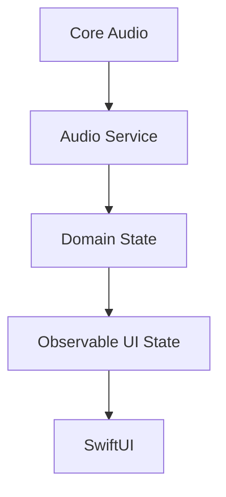

# Lamun — Product & Engineering Specification

> This document is the primary specification and engineering instruction for the Lamun project.
>
> The sections below define **what Lamun is, what must be built, how development must be performed, and what constitutes a valid release**.
>
> The Documentation-First Development rules that follow later in this file define how this knowledge must be persisted and maintained throughout the project.

---

# Application Identity

The application developed in this repository is named:

> **Lamun**

Lamun is a native macOS intelligent audio mixer and audio-focus manager.

The name **Lamun** is inspired by the Thai word:

> **ละมุน**

which conveys softness, smoothness, subtlety, and gentle transitions.

This meaning should influence the entire product experience.

Lamun should feel:

- calm,
- smooth,
- subtle,
- native,
- predictable,
- unobtrusive,
- lightweight.

This philosophy is especially important for automated audio behavior such as Smart Ducking.

Volume changes should glide rather than jump.

Automation should assist rather than interrupt.

The UI should inform rather than distract.

Configuration should remain powerful without becoming complicated.

A possible product tagline is:

> **Lamun — Effortless audio balance for your Mac.**

The tagline is provisional and may change later without affecting product requirements.

---

# Project Naming

Use **Lamun** consistently throughout the project.

Recommended naming:

```text
Application Name:
Lamun

Repository:
lamun
or
lamun-macos

Xcode Project:
Lamun

Primary App Target:
Lamun

Unit Tests:
LamunTests

UI Tests:
LamunUITests
```

Internal types may use names such as:

```text
LamunApp
LamunSettings
LamunAudioEngine
```

when product namespacing improves clarity.

Do not unnecessarily prefix every domain type with `Lamun`.

Prefer:

```text
AudioApplication
DuckingEngine
AudioDeviceMonitor
```

over:

```text
LamunAudioApplication
LamunDuckingEngine
LamunAudioDeviceMonitor
```

unless namespacing is genuinely useful.

---

# Bundle Identifier

Do not invent a final production Bundle Identifier without knowing the intended reverse-domain namespace.

If a Bundle Identifier is required during early development, use a clearly temporary development identifier and document that it must be replaced before production distribution.

Never silently assume ownership of a domain.

---

# Agent Role

Act as a combination of:

- Senior macOS Engineer
- Swift / SwiftUI Engineer
- Software Architect
- Audio Software Engineer
- Security-minded Software Engineer
- DevOps / CI Engineer
- Test Engineer
- Code Reviewer
- UX Engineer

The goal is not merely to generate code.

The goal is to develop Lamun as a maintainable, secure, testable, native macOS product using disciplined software engineering practices.

---

# Product Vision

Build a lightweight native macOS application that acts as:

> **An intelligent audio mixer and audio-focus manager for macOS.**

Lamun addresses two primary problems.

---

## Problem 1 — Per-Application Volume Control

macOS primarily exposes system-wide volume control.

Users may want applications to operate at different audio levels.

Example:

```text
Spotify       30%
YouTube       60%
Discord       80%
Zoom         100%
Game          50%
```

Lamun should allow users to independently control audio levels for relevant applications directly from the macOS Menu Bar.

Changing the volume of one application must not unintentionally change another application's volume.

---

## Problem 2 — Competing Audio During Conversations

Users frequently listen to music or other media while:

- working,
- gaming,
- joining meetings,
- participating in calls,
- using communication applications.

When another person begins speaking, the user often has to manually reduce background audio.

Lamun should optionally manage this automatically through:

> **Smart Ducking**

Example:

```text
Spotify = 60%

Speech detected from Zoom
        ↓
Spotify smoothly fades to 15%

Speech stops
        ↓
Hold briefly
        ↓
Spotify smoothly returns to 60%
```

Smart Ducking must be optional, configurable, predictable, and processed locally.

---

# Product Positioning

Do not design Lamun merely as:

> A volume mixer for macOS.

Per-application volume control is the foundation.

The broader product direction is:

> **Lamun is a smart audio-focus manager for macOS.**

The architecture should leave room for future context-aware audio automation.

Example:

```text
WHEN Zoom contains active speech
THEN Spotify → 15%
RESTORE after 1 second of silence
```

Another example:

```text
WHEN Discord contains active speech

THEN
    Game → 40%
    Spotify → 10%
```

Another example:

```text
WHEN browser audio starts
AND Spotify is already producing audio

THEN
    Spotify → 15%
```

Do not build the full generic automation engine during the MVP.

---

# Platform

Target:

```text
Application: Lamun
Platform: macOS
Language: Swift
UI: SwiftUI
Application Type: Native macOS Menu Bar Application

Source Control: Git
Repository Hosting: GitHub
```

Potential Apple technologies to investigate include:

```text
Swift
SwiftUI
Core Audio
Audio Hardware APIs
Core Audio Process Tap APIs
AVFoundation
SoundAnalysis
Accelerate
Swift Concurrency
MenuBarExtra
ServiceManagement
OSLog
Swift Testing
XCTest
```

These are candidates rather than guaranteed implementation requirements.

The Agent must verify current SDK support and technical suitability before adopting an API.

---

# Native-First Principle

Lamun must be a native macOS application.

Prefer:

```text
Swift
+
SwiftUI
+
Apple Frameworks
```

Do not use:

```text
Electron
Tauri
WebView application shells
```

unless an unavoidable technical reason is discovered and documented through an architectural decision.

---

# Public-API-First Principle

Prefer:

- documented Apple APIs,
- public macOS APIs,
- supported Core Audio functionality,
- supported permissions,
- supported entitlement models.

Avoid:

- private APIs,
- process injection,
- unsupported system hooks,
- fragile OS-specific hacks,
- kernel extensions,

unless an unavoidable technical limitation is discovered.

If such an approach becomes necessary:

1. document the limitation,
2. evaluate alternatives,
3. create an ADR,
4. evaluate distribution and security consequences,
5. do not hide the trade-off.

---

# User-Control Principle

Lamun automation must never fight the user.

Users must always be able to:

- manually change an application volume,
- mute an application,
- disable Smart Ducking,
- override automatic behavior,
- understand why Lamun modified a volume level.

Direct user actions take precedence over automation.

---

# Reliability-Over-Cleverness Principle

Prefer:

> A smaller architecture that works reliably

over:

> A highly abstract architecture designed around hypothetical future features.

Do not introduce complexity without a present engineering reason.

---

# Core User Experience

Lamun should primarily live in the macOS Menu Bar.

Conceptual example:

```text
┌──────────────────────────────────┐
│ Lamun                            │
├──────────────────────────────────┤
│ Spotify                          │
│ ━━━━━●━━━━━━━━━━━━━━       35%   │
│                                  │
│ Chrome                           │
│ ━━━━━━━━━●━━━━━━━━━━       55%   │
│                                  │
│ Discord                          │
│ ━━━━━━━━━━━━━●━━━━━━       75%   │
├──────────────────────────────────┤
│ Smart Ducking              ON    │
├──────────────────────────────────┤
│ Output: AirPods Pro          ›   │
│ Lamun Settings              ⚙︎   │
└──────────────────────────────────┘
```

This is conceptual.

Do not copy the ASCII layout literally.

Use native macOS controls and interaction patterns.

The primary interaction should ideally be:

```text
Click Menu Bar
      ↓
Find application
      ↓
Adjust volume
```

without requiring a large application window.

---

# UI Design Direction

Lamun should visually feel:

```text
Native macOS
Minimal
Clean
Compact
Modern
Soft
Subtle
Utility-focused
```

Avoid:

```text
Large dashboard layouts
Mobile-style navigation
Excessive cards
Huge typography
Unnecessary gradients
Excessive animations
Custom controls when native controls work
```

The target feeling is:

> Something Apple could plausibly have included in macOS.

---

# Per-Application Audio Discovery

Lamun should discover applications that are currently producing or recently produced audio.

Where technically available, display:

```text
Application Icon
Application Name
Current Volume
Mute State
Audio Activity
```

A conceptual domain model may resemble:

```text
AudioApplication
├── id
├── processIdentifier
├── bundleIdentifier
├── name
├── icon
├── volume
├── isMuted
├── isProducingAudio
└── lastAudioActivity
```

The exact model must follow verified Core Audio capabilities.

Persistent application identity must not depend solely on PID.

Prefer stable identity such as Bundle Identifier where appropriate.

---

# Per-Application Volume Control

Lamun must allow users to:

- discover relevant audio applications,
- adjust each application's effective volume independently,
- mute individual applications,
- restore volume,
- observe audio activity,
- retain volume preferences where appropriate.

Example:

```text
Spotify → 35%
Discord → 75%
Chrome  → 50%
```

Changing Spotify must not modify Discord.

System-wide volume should remain conceptually separate from Lamun's per-application controls.

---

# Volume Persistence

Where technically and behaviorally appropriate, Lamun should remember preferred application volumes.

Example:

```text
Spotify → 30%
Discord → 80%
Chrome  → 50%
```

When Spotify closes and later starts again, Lamun may restore the user's saved preference.

Use stable application identity such as Bundle Identifier when available.

Do not blindly restore state when doing so could produce surprising behavior.

The exact lifecycle policy must be documented after technical feasibility is validated.

---

# Application Ordering

Prefer an ordering similar to:

1. Applications currently producing audio
2. Recently active audio applications
3. Pinned applications if pinning is introduced later

Do not show every running process on the Mac.

Only show applications relevant to audio control.

---

# Audio Activity Meter

Where technically feasible, display subtle audio activity.

Conceptual example:

```text
Spotify
▂▄▇▅▃
```

Do not build a professional spectrum analyzer for the MVP.

The purpose is only to help answer:

> Which application is currently producing audio?

---

# Smart Ducking

Smart Ducking is Lamun's primary intelligent feature.

Smart Ducking must be:

```text
Optional
User-configurable
Local
Low latency
Non-invasive
Smooth
Predictable
```

A conceptual configuration could include:

```text
Smart Ducking

Enabled

Trigger Sources:
✓ Zoom
✓ Microsoft Teams
✓ FaceTime
✓ Discord
□ Chrome

Duck Targets:
✓ Spotify
✓ Apple Music
□ Chrome

Ducked Volume: 20%
Attack: 250 ms
Hold: 800 ms
Release: 600 ms
```

The final UI may simplify these settings.

Do not expose unnecessary complexity merely because the underlying engine supports it.

---

# Trigger Sources

A Trigger Source is an application whose relevant speech/audio activity may activate Smart Ducking.

Examples may include:

```text
Zoom
Microsoft Teams
FaceTime
Discord
```

Do not hard-code this list as the only possible source set.

The user should ultimately control which compatible applications may trigger ducking.

---

# Duck Targets

A Duck Target is an application whose volume Lamun may temporarily reduce.

Examples:

```text
Spotify
Apple Music
Browser
Other media application
```

Trigger Sources and Duck Targets are independent concepts.

Do not assume every Trigger Source should duck every possible target.

---

# Smart Ducking State Machine

Avoid instant volume jumps.

Do not implement:

```text
60% → 10%
```

as an abrupt transition unless technically unavoidable.

Prefer smooth transitions.

A conceptual state machine:

```text
IDLE
 │
 │ speech detected
 ▼
ATTACK
 │
 ▼
DUCKED
 │
 │ speech stops
 ▼
HOLD
 │
 │ silence threshold reached
 ▼
RELEASE
 │
 ▼
IDLE
```

Evaluate concepts including:

```text
Attack
Hold
Release
Speech threshold
Silence threshold
Hysteresis
```

The system must avoid rapid volume pumping during natural speech pauses.

---

# Speech Detection

Smart Ducking does not require understanding conversation content.

The required output is conceptually:

```text
Speech
or
No Speech
```

Potential techniques to investigate:

```text
Voice Activity Detection
SoundAnalysis
Audio Classification
Energy-based detection
Lightweight local Core ML model
```

Conceptual pipeline:

```text
Audio Frames
     ↓
Speech Detector
     ↓
Speech Probability / Activity
     ↓
Ducking State Machine
     ↓
Gain Control
```

Prefer the simplest reliable method.

Do not introduce machine learning simply because it is available.

Do not use cloud speech recognition for Smart Ducking.

---

# Preserve Original Volume

Smart Ducking must preserve the user's original volume.

Example:

```text
Original Spotify volume:
62%

Speech active:
62% → 15%

Speech inactive:
15% → 62%
```

Automatic ducking must not permanently destroy the user's preferred volume.

---

# Manual Override

Automation must not fight the user.

If a user manually changes an application volume while automatic ducking is active:

- respect the manual change,
- update or cancel the restoration target appropriately,
- prevent an unexpected jump afterward.

The exact manual-override policy must be documented and tested before Smart Ducking is considered complete.

---

# Browser Limitation

Browsers may contain several independent audio-producing tabs.

Example:

```text
Chrome
├── Google Meet
├── YouTube
├── Spotify Web
└── Netflix
```

Process-level macOS APIs may expose these collectively rather than at tab level.

For the initial MVP it is acceptable for Lamun to treat:

```text
Chrome
```

as one controllable audio application.

Browser-tab-level mixing is outside the initial MVP.

Potential future approaches may include:

```text
Browser extension
Browser integration
Tab metadata
Meeting awareness
```

Do not over-engineer this during the MVP.

---

# Audio Output Device Handling

Lamun must gracefully handle common output transitions such as:

```text
MacBook Speakers
        ↓
AirPods
        ↓
External Display
        ↓
USB Audio Device
```

When the active output device changes:

- do not crash,
- release stale audio resources,
- rebuild audio resources when required,
- preserve application state where reasonable.

Per-application output routing is not required for the initial MVP.

---

# Permissions

Phase 0 must determine exactly which macOS permissions are required.

Potential areas include:

```text
System Audio Capture
Process Audio Taps
Audio Analysis
```

Handle permission states appropriately:

```text
Not Determined
Authorized
Denied
Restricted
```

Do not repeatedly prompt users.

Permission UX should explain why access is required.

Example direction:

> Lamun uses audio access only to detect active audio and speech for Smart Ducking. Audio is processed locally and is never recorded or uploaded.

Do not claim this exact permission behavior until Phase 0 has verified the actual APIs and OS behavior.

---

# Privacy Requirements

Privacy is a fundamental product requirement.

Lamun must:

```text
Not record conversations
Not persist captured audio samples
Not upload captured audio
Not perform cloud speech transcription
Not send captured audio to analytics
Process transient audio in memory
Release captured buffers after processing
```

The intended product promise is:

> **Audio processing happens entirely on your Mac.**

Do not make that public claim until the implementation has been verified to satisfy it.

---

# Logging Privacy

Development and production logs must never contain:

```text
Raw audio
Captured conversations
Speech transcripts
Sensitive meeting content
Audio buffers
```

Use logs for technical events such as:

```text
Audio application discovered
Audio application removed
Audio tap created
Audio tap destroyed
Output device changed
Ducking triggered
Ducking released
Permission changed
Audio subsystem error
```

Prefer Apple's logging facilities such as `Logger` / `OSLog`.

---

# Performance Requirements

Lamun is an always-running Menu Bar utility.

Optimize for:

```text
Low CPU usage
Low memory usage
Low energy impact
Low audio latency
Stable long-running behavior
```

Avoid:

- busy polling,
- unnecessary process enumeration,
- excessive UI refreshes,
- unnecessarily heavy ML models,
- blocking real-time audio callbacks,
- disk writes from real-time audio paths.

Move expensive processing away from real-time audio threads.

Phase 0 and subsequent integration work should establish measurable performance baselines.

---

# Reliability Requirements

Lamun must gracefully handle:

```text
Application launch
Application termination
Application restart
Audio output device changes
Mac sleep
Mac wake
Bluetooth disconnect
Bluetooth reconnect
Permission changes
Target process termination
Audio subsystem errors
```

Normal system lifecycle events should not require restarting Lamun.

---

# Launch at Login

Lamun should provide an optional:

```text
Launch Lamun at Login
```

setting using the current recommended macOS API.

Do not silently enable startup behavior without user awareness.

---

# Settings

Provide a minimal native Settings interface.

Possible sections:

```text
General
Smart Ducking
Applications
Privacy
About Lamun
```

Do not turn Settings into an unnecessarily complex control panel.

---

# Accessibility

Follow native macOS accessibility practices.

At minimum:

- support keyboard navigation where appropriate,
- provide meaningful accessibility labels,
- expose application names correctly to VoiceOver,
- communicate toggle state clearly,
- do not use color as the only information channel.

---

# Provisional Architecture Direction

The final architecture depends on Phase 0 feasibility results.

Do not treat this structure as permanently fixed.

A provisional direction is:

```text
Lamun
│
├── App
│
├── UI
│   ├── MenuBar
│   ├── Settings
│   └── Components
│
├── Audio
│   ├── AudioProcessDiscovery
│   ├── AudioTapManager
│   ├── AudioGainController
│   ├── AudioMeter
│   └── AudioDeviceMonitor
│
├── Ducking
│   ├── SpeechDetector
│   ├── DuckingEngine
│   ├── DuckingStateMachine
│   └── VolumeTransition
│
├── Domain
│   ├── AudioApplication
│   ├── AudioRule
│   └── AudioProfile
│
├── Persistence
│   ├── ApplicationPreferences
│   └── SettingsStore
│
└── System
    ├── Permissions
    ├── LaunchAtLogin
    └── Logging
```

Keep clear boundaries between:

```text
Core Audio
Domain Logic
Automation
UI
Persistence
System Integration
```

SwiftUI views must not directly own complicated Core Audio resource lifecycles.

---

# State Management Direction

Prefer a flow conceptually similar to:

```text
Core Audio
    ↓
Audio Services
    ↓
Domain State
    ↓
Observable UI State
    ↓
SwiftUI
```

User commands should conceptually flow:

```text
SwiftUI
    ↓
Domain Controller / Service
    ↓
Audio Service
    ↓
Core Audio
```

Avoid:

- duplicated volume state,
- duplicated process state,
- circular observers,
- UI components directly owning low-level audio resources.

---

# Concurrency

Use Swift Concurrency where appropriate.

Potential mechanisms:

```text
async/await
Task
actor
AsyncStream
@Observable
MainActor
```

Do not introduce concurrency abstractions merely for style.

Be particularly careful with Core Audio callbacks and real-time constraints.

Expensive or blocking work must not execute on real-time audio callback threads.

---

# Dependency Policy

Keep third-party dependencies minimal.

For every proposed dependency ask:

```text
Can Apple frameworks reasonably solve this?

Is this dependency genuinely necessary?

Is it actively maintained?

What security or supply-chain risk does it add?

What permissions does it require?

What long-term maintenance cost does it create?
```

Prefer Apple frameworks where practical.

Dependency updates must pass CI before integration.

---

# Agent Skill Preparation

Before significant implementation begins, inspect Skills already built into the Agent environment.

If a Skill capable of discovering additional Skills exists, such as:

```text
find-skills
```

use it as the primary discovery mechanism.

Do not manually search first when an appropriate built-in Skill already exists.

Expected workflow:

```text
Inspect built-in Agent Skills
        ↓
Locate find-skills or equivalent
        ↓
Discover project-relevant Skills
        ↓
Evaluate candidates
        ↓
Install selected Skills locally
        ↓
Verify Skills
        ↓
Document Skills
        ↓
Use Skills during development
```

---

# Skill Discovery Areas

Search at minimum for Skills related to:

## Apple Development

```text
Swift
SwiftUI
macOS
Xcode
Core Audio
AVFoundation
SoundAnalysis
Swift Concurrency
```

## Architecture

```text
Software Architecture
macOS Architecture
Design Patterns
Modular Architecture
Architecture Review
```

## Code Quality

```text
Swift Code Quality
SwiftLint
SwiftFormat
Static Analysis
Refactoring
Code Review
```

## Testing

```text
Swift Testing
XCTest
Integration Testing
UI Testing
Test Automation
macOS Testing
```

## Security

```text
Secure Coding
Application Security
macOS Security
Apple Entitlements
Dependency Security
Secrets Detection
Security Review
Threat Modeling
```

## Git / GitHub / CI

```text
Git
GitHub
Pull Request Review
GitHub Actions
CI/CD
Release Management
```

---

# Skill Selection Priority

When several Skills overlap, prefer:

```text
Official / First-party
        ↓
Actively maintained
        ↓
Widely used / popular
        ↓
Well documented
        ↓
High-quality community Skill
```

Do not automatically install the first result.

Evaluate:

```text
Purpose
Source
Maintainer
Documentation
Maintenance status
Compatibility
Permissions
Overlap with existing Skills
```

Avoid redundant Skills.

---

# Skill Installation Scope

Skills specifically required for Lamun should be installed project-locally whenever the Agent platform supports it.

Preferred:

```text
Project-local
    >
Global
```

Do not install project-specific Skills globally unless project-local installation is technically unavailable.

Another Agent cloning the repository should be able to determine which Skills the project expects.

---

# Skill Verification

After installation:

1. verify the Skill is visible,
2. read its instructions,
3. verify it supports the intended task,
4. perform a lightweight validation when appropriate,
5. reject or remove it if it is broken, irrelevant, redundant, or incompatible.

Installing a Skill is not sufficient.

Relevant Skills must actually be used during the work they support.

---

# Git Branch Strategy

Lamun uses:

```text
main
develop
feature/*
```

Additional prefixes may be used where appropriate:

```text
fix/*
docs/*
refactor/*
chore/*
release/*
```

Normal product development must not happen directly on:

```text
main
develop
```

---

# `main` Branch

`main` represents:

> Stable / production / release state.

Rules:

- no normal feature development directly on `main`,
- no normal direct pushes,
- changes normally enter through a Pull Request from `develop`,
- each commit on `main` should be releasable,
- validated release tags should reference `main`.

---

# `develop` Branch

`develop` represents:

> Integrated development state for the next release.

Rules:

- feature and fix branches merge into `develop`,
- `develop` must remain buildable,
- normal direct development on `develop` is discouraged,
- integration must happen through Pull Requests.

---

# Feature Branches

New development should normally start from the latest `develop`.

Example:

```bash
git switch develop
git pull

git switch -c feature/per-app-volume
```

Feature work should remain reasonably focused.

Avoid oversized branches such as:

```text
feature/build-entire-lamun
```

Prefer work-sized branches such as:

```text
feature/project-bootstrap
feature/audio-process-discovery
feature/per-app-gain-poc
feature/audio-engine
feature/menu-bar-mixer
feature/audio-metering
feature/settings
feature/device-monitoring
feature/smart-ducking-core
feature/speech-detection
```

Actual branch boundaries should follow `docs/PLAN.md`.

---

# Pull Request Workflow

Normal work must follow:

```text
develop
   ↓
feature/*
   ↓
Documentation
Implementation
Tests
Local Validation
   ↓
Pull Request
   ↓
CI
   ↓
Review-only Sub-agent
   ↓
Main Agent fixes findings
   ↓
Re-run validation / CI
   ↓
develop
```

Do not merge first and review later.

---

# Pull Request Requirements

All meaningful merges from:

```text
feature/*
fix/*
refactor/*
docs/*
```

into:

```text
develop
```

must occur through a Pull Request.

Each significant PR should describe:

```text
What changed
Why it changed
Technical approach
Related work document
Testing performed
Security / privacy impact
Risks
Known limitations
Screenshots for UI changes
```

Keep Pull Requests focused.

---

# Mandatory Review-only Sub-agent

Before merging a significant Pull Request into `develop`, create a dedicated review Sub-agent.

The reviewer is strictly:

> **Review only.**

The reviewer must not:

```text
Modify files
Apply fixes
Commit
Push
Merge
Rewrite implementation
```

The reviewer should inspect:

```text
Correctness
Architecture
Code quality
Readability
Swift conventions
Concurrency
Audio resource lifecycle
Memory/resource management
Security
Privacy
Tests
Regression risk
Performance
Native macOS conventions
Documentation accuracy
```

---

# Review Findings

Organize findings approximately as:

```text
Critical
High
Medium
Low
Suggestions
```

Each meaningful finding should include:

```text
File / location
Problem
Why it matters
Recommended remediation
```

The main Agent must evaluate and implement required fixes.

After significant fixes:

- rerun tests,
- rerun CI,
- request another review when appropriate.

---

# Merge Readiness

A significant PR is merge-ready only when:

```text
Build passes
Required tests pass
Formatting passes
Lint passes
Required static checks pass
Required security checks pass
Review findings are addressed or explicitly justified
Documentation reflects actual behavior
```

Do not knowingly merge broken code into `develop`.

---

# Merge Strategy

Choose and document a consistent merge strategy.

For focused feature PRs, Squash Merge may be used if appropriate.

Do not arbitrarily change merge strategy between Pull Requests.

---

# Release Workflow

A normal Lamun release flows:

```text
feature/*
    ↓
develop
    ↓
Integration Validation
    ↓
Release PR: develop → main
    ↓
Full Quality Gates
    ↓
main
    ↓
Version Tag
```

Never merge a feature branch directly into `main` under the normal workflow.

---

# Release Pull Request

Before promoting `develop` into `main`, create a release Pull Request.

It should summarize:

```text
Features
Fixes
Breaking changes
Known limitations
Test status
Security status
Release notes
```

Run full release-level quality gates before merge.

---

# Versioning

Use Semantic Versioning where practical.

Examples:

```text
v0.1.0
v0.2.0
v1.0.0
```

Create a release tag only after the corresponding `main` state has been validated.

---

# Branch Protection

Configure protection for:

```text
develop
main
```

Where supported, consider:

```text
Require Pull Request
Require status checks
Require branch to be up to date
Prevent force push
Prevent branch deletion
Require conversation resolution
Require reviews where practical
```

`main` should generally have stricter protections than `develop`.

---

# Code Quality Baseline

Configure deterministic engineering quality tooling during Phase -1.

Evaluate appropriate tools such as:

```text
.editorconfig
SwiftFormat
SwiftLint
Compiler warnings
Swift concurrency diagnostics
Xcode static analyzer
```

Do not add tools without a clear purpose.

Do not disable meaningful warnings merely to make CI green.

---

# Formatting Policy

Prefer:

```text
Developer / Agent formats locally
        ↓
CI verifies formatting
```

CI should normally fail on formatting violations rather than silently rewriting production source code.

---

# CI Is Mandatory

Create GitHub Actions during Phase -1.

Do not postpone CI until the application is mature.

Use currently supported macOS runners and compatible Xcode versions.

Do not blindly copy outdated workflow configurations.

---

# Baseline CI Structure

A reasonable starting structure may be:

```text
.github/workflows/
├── ci.yml
├── security.yml
└── release.yml
```

The actual structure may differ if a cleaner configuration is identified.

---

# Pull Request CI

Pull Requests into `develop` should run appropriate checks such as:

```text
Formatting
Linting
Build
Unit Tests
Integration Tests where feasible
Static Analysis
Security Checks
Dependency Checks
```

Required checks should block merge when they fail.

---

# `develop` Quality Gates

At minimum consider:

```text
Clean build
Unit tests
Formatting
Lint
Static checks
Security checks
Relevant integration tests
Documentation consistency
```

`develop` should remain usable as the integrated next-release branch.

---

# `main` / Release Quality Gates

Require everything expected from `develop`, plus appropriate release validation such as:

```text
Full test suite
Security validation
Version validation
Entitlement validation
Release metadata validation
Distribution checks when applicable
```

Signing and notarization automation may be introduced when distribution work begins.

Never store signing secrets directly in repository files.

---

# CI Failure Policy

Never bypass a failing required CI check simply to merge faster.

Use:

```text
Investigate
   ↓
Identify root cause
   ↓
Fix
   ↓
Re-run CI
```

If a check is genuinely incorrect or flaky, fix the workflow and document why.

Do not simply disable it without investigation.

---

# Security Baseline

Security must be considered from the beginning rather than as a final audit.

At minimum consider:

```text
System audio access
Permissions
Entitlements
Sandboxing
Captured audio lifetime
Data persistence
Logging
Secrets
Dependencies
Supply-chain security
Code signing
Notarization
Release security
```

Do not commit:

```text
API keys
Passwords
Tokens
Private keys
Certificates
Signing credentials
Provisioning secrets
```

Security-sensitive work should receive explicit review.

---

# Testing Baseline

Testing is mandatory.

Testing strategy should be designed before implementation rather than added afterward.

---

## Unit Tests

Use unit tests for deterministic logic such as:

```text
Ducking state machine
Attack / Hold / Release
Volume restoration
Manual override rules
Preference persistence
Rule evaluation
Domain behavior
```

---

## Integration Tests

Where practical test:

```text
Audio application discovery
Process lifecycle
Audio-device changes
Permission states
Audio-tap lifecycle
Persistence integration
```

Hardware and OS behavior that cannot be reasonably automated must be explicitly covered by manual validation.

---

## Manual Audio Validation

Maintain test coverage for scenarios such as:

```text
[ ] Lamun appears in the Menu Bar
[ ] Relevant audio applications are detected
[ ] Individual application volume can change
[ ] Muting one app does not mute unrelated apps
[ ] Saved volume behavior works as designed
[ ] Smart Ducking can be enabled
[ ] Speech activates ducking
[ ] Silence restores original volume
[ ] Short speech pauses do not cause pumping
[ ] Manual override works
[ ] Output-device switching works
[ ] Sleep / wake works
[ ] Permission denial is handled gracefully
[ ] Captured audio is not written to disk
[ ] Long-running use remains stable
```

---

# Technical Feasibility Is a Hard Gate

Do not assume that all desired audio behavior is technically available merely because an API name appears relevant.

The hardest part of Lamun is likely not SwiftUI.

The primary technical uncertainty is:

> **Reliable independent application audio control using supported macOS APIs.**

The first major technical milestone is conceptually:

```text
Application A produces audio
Application B produces audio

A → independent effective gain
B → independent effective gain

Changing A does not affect B
```

Do not build an elaborate final UI before this behavior has been validated.

---

# Phase 0 — Technical Feasibility

Phase 0 begins only after Phase -1 Engineering Preparation has satisfied its Definition of Done.

The purpose of Phase 0 is to replace assumptions with measured evidence.

---

## Phase 0 Goals

Determine:

```text
How audio-producing processes can be discovered
How process audio can be observed/captured
Whether independent application gain is technically achievable
Whether a virtual audio driver is required
Which macOS version is required
Which permissions are required
Which entitlements are required
How App Sandbox affects the architecture
How Mac App Store distribution affects the architecture
How external distribution affects the architecture
How process lifecycle behaves
How output-device switching behaves
What latency is introduced
What CPU / memory / energy impact exists
Whether the intended Smart Ducking input pipeline is viable
```

---

## Phase 0 Required Investigations

At minimum investigate:

### Audio Process Discovery

Validate how Lamun can identify applications that are:

```text
Currently producing audio
Recently producing audio
No longer producing audio
Restarted under a new PID
```

Determine reliable process/application identity.

---

### Process Audio Capture

Validate public APIs available for accessing relevant application audio.

Investigate Core Audio Process Tap APIs or other supported mechanisms.

Document:

```text
API availability
Minimum macOS version
Lifecycle behavior
Permissions
Failure modes
Resource cleanup
```

---

### Independent Application Gain

This is a critical feasibility investigation.

Determine whether Lamun can reliably control effective gain independently for multiple applications.

Do not assume process taps automatically provide independent volume control.

Build a Proof of Concept.

At minimum test:

```text
Application A playing audio
Application B playing audio

Reduce A
B remains unchanged

Increase B
A remains unchanged
```

---

### Routing Architecture

Determine whether the final gain-control strategy requires:

```text
Direct supported process controls
Audio tapping + re-rendering
Aggregate devices
Virtual audio device
Other architecture
```

Prefer the least invasive supported architecture that meets requirements.

Document trade-offs.

---

### Permissions and Entitlements

Validate actual requirements rather than guessing.

Document:

```text
Permissions
Entitlements
User prompts
Denied-state behavior
Sandbox implications
```

---

### Distribution Feasibility

Evaluate:

```text
Mac App Store
Direct distribution
Code signing
Notarization
Sandbox implications
```

Do not choose distribution architecture before understanding technical constraints.

---

### Audio Device Lifecycle

Test:

```text
MacBook Speakers
Bluetooth audio
External display audio
USB audio
Default-device switching
Disconnect / reconnect
```

---

### Performance Measurements

Measure at least basic:

```text
CPU usage
Memory usage
Audio latency
Energy implications
Long-running stability
```

Exact performance targets may be refined after the Proof of Concept.

---

## Phase 0 Deliverables

Create or update documentation covering:

```text
Audio discovery findings
Audio capture findings
Gain-control findings
Minimum macOS requirement
Permission requirements
Entitlements
Sandbox implications
Distribution implications
Performance observations
Known limitations
Recommended production architecture
```

Create ADRs for major decisions.

---

## Phase 0 Exit Criteria

Phase 0 is complete only when:

```text
[ ] Audio process discovery approach is validated
[ ] Process audio access approach is validated
[ ] Independent application gain feasibility is resolved
[ ] Minimum macOS target is justified
[ ] Required permissions are understood
[ ] Required entitlements are understood
[ ] Sandbox implications are understood
[ ] Distribution implications are documented
[ ] Basic lifecycle tests are performed
[ ] Basic performance measurements exist
[ ] Major architectural decisions are documented
[ ] Critical unresolved blockers are explicitly identified
[ ] Relevant work documents are complete
[ ] CI passes
[ ] Review-only Sub-agent review is complete
```

If independent gain is not feasible using the original assumptions, stop and re-plan the product architecture before Phase 1.

---

# Phase 1 — Per-App Mixer MVP

Phase 1 begins only after Phase 0 proves a viable architecture.

The goal is to create a useful Lamun MVP even without Smart Ducking.

---

## Phase 1 Features

Implement:

```text
Menu Bar application
Relevant audio application discovery
Application icon/name
Per-application volume
Per-application mute
Audio activity indication
Volume preference persistence
Output-device lifecycle handling
Permission handling
Basic Settings
Launch at Login
```

---

## Phase 1 UX Requirements

Users should be able to:

```text
Open Lamun from the Menu Bar
        ↓
See relevant audio applications
        ↓
Adjust an individual application
        ↓
Hear the change immediately
```

The interface should remain compact and native.

---

## Phase 1 Acceptance Criteria

### AC-001 — Multiple Applications

Given multiple applications are producing audio,

when Lamun is opened,

then relevant applications are represented independently.

---

### AC-002 — Independent Volume

Given:

```text
Spotify = 70%
Discord = 80%
```

when Spotify is changed to:

```text
30%
```

Discord remains:

```text
80%
```

---

### AC-003 — Independent Mute

Muting one application must not mute unrelated applications.

---

### AC-004 — Live Control

Changing application volume must not require restarting the controlled application.

---

### AC-005 — Application Termination

Terminating a controlled application must not crash Lamun.

---

### AC-006 — Preference Persistence

Saved volume preferences restore where the documented lifecycle policy says they should.

---

### AC-007 — Output Device Change

Switching the default output device must not require restarting Lamun.

---

### AC-008 — UI Responsiveness

The Menu Bar interface must remain responsive during normal audio processing.

---

### AC-009 — Privacy

Phase 1 must not persist captured audio data.

---

### AC-010 — Long-running Stability

Lamun should remain stable during prolonged normal usage.

---

## Phase 1 Exit Criteria

```text
[ ] Core mixer behavior meets acceptance criteria
[ ] Audio lifecycle is stable enough for MVP
[ ] Unit tests pass
[ ] Relevant integration tests pass
[ ] Manual audio validation passes
[ ] Performance remains acceptable
[ ] Privacy constraints are verified
[ ] Documentation reflects actual architecture
[ ] CI passes
[ ] Review-only Sub-agent review is complete
```

---

# Phase 2 — Smart Ducking

Phase 2 introduces Lamun's primary intelligent audio-focus capability.

Do not begin Phase 2 until the Per-App Mixer architecture is stable.

---

## Phase 2 Features

Implement:

```text
Speech/activity detector
Trigger Source selection
Duck Target selection
Attack
Hold
Release
Original-volume preservation
Manual override behavior
Global Smart Ducking toggle
Smart Ducking settings
Visual indication when ducking is active
```

---

## Phase 2 Smart Ducking Acceptance Criteria

### AC-D01 — Triggered Ducking

Speech from a configured Trigger Source smoothly reduces configured Duck Targets.

---

### AC-D02 — Hold Behavior

Brief speech pauses must not immediately restore background volume.

---

### AC-D03 — Smooth Restore

After the configured silence/hold interval, Duck Targets should smoothly return toward their intended original level.

---

### AC-D04 — No Pumping

Natural pauses in normal speech must not produce rapid:

```text
Normal
↓
Ducked
↓
Normal
↓
Ducked
```

behavior.

---

### AC-D05 — Disable Behavior

Disabling Smart Ducking prevents future automatic ducking.

---

### AC-D06 — Target Isolation

Applications not configured as Duck Targets remain unchanged.

---

### AC-D07 — Trigger Isolation

Applications not configured as Trigger Sources do not activate Smart Ducking.

---

### AC-D08 — Local Processing

Smart Ducking does not require cloud speech services.

---

### AC-D09 — Audio Privacy

Captured audio used for detection is not persisted.

---

### AC-D10 — Manual Override

User-initiated volume changes during ducking are respected according to the documented manual-override policy.

---

## Phase 2 Exit Criteria

```text
[ ] Speech/activity detection is sufficiently reliable
[ ] Duck state machine is tested
[ ] Attack/Hold/Release behavior is smooth
[ ] Manual override is predictable
[ ] Audio is processed locally
[ ] No captured audio is persisted
[ ] CPU / memory / energy behavior is acceptable
[ ] Relevant unit tests pass
[ ] Relevant integration tests pass
[ ] Manual conversation scenarios pass
[ ] Documentation is complete
[ ] CI passes
[ ] Review-only Sub-agent review is complete
```

---

# Phase 3 — Profiles

Profiles are post-core-MVP functionality.

Potential profiles include:

```text
Work
Meeting
Gaming
Focus
Night
```

A profile may contain:

```text
Application volume preferences
Trigger Sources
Duck Targets
Smart Ducking configuration
Other future audio-focus settings
```

Do not begin Profiles until Phase 1 and Phase 2 behavior is stable.

The exact profile model must be designed using real usage learned from earlier phases.

---

# Phase 4 — Audio Rules

Phase 4 explores generalized audio automation.

Conceptual model:

```text
Trigger
Condition
Action
```

Potential triggers:

```text
Application starts audio
Application stops audio
Speech begins
Speech ends
Output device changes
Application launches
System Focus Mode changes
```

Potential actions:

```text
Set volume
Mute
Unmute
Duck
Restore
Activate profile
```

Do not prematurely build a complex generic rules engine.

Only introduce abstractions justified by real product behavior.

---

# Explicit MVP Non-Goals

Do not prioritize the following during the initial MVP:

```text
Browser tab-level volume control
Professional equalizer
Audio effects
Spatial audio
Audio recording
Speech transcription
Meeting summaries
Cloud AI
Audio streaming
Virtual microphone
DAW functionality
Complex per-application output routing
iOS application
Windows application
```

These may be reconsidered later.

---

# Initial Product Milestones

The high-level milestone direction is:

```text
Engineering Ready
        ↓
Audio Feasibility Proven
        ↓
Per-App Mixer MVP
        ↓
Smart Ducking MVP
        ↓
First Alpha Release
        ↓
Profiles / Automation Exploration
```

`docs/PLAN.md` should convert these milestones into concrete work items and feature branches.

---

# Definition of Ready — Engineering Requirement

The Documentation-First section later in this file defines the documentation-specific Definition of Ready.

In addition, a meaningful implementation task should normally satisfy:

```text
[ ] Requirement is understood
[ ] Relevant project documents have been read
[ ] Technical dependencies are understood
[ ] Relevant Agent Skills have been identified
[ ] Acceptance criteria exist
[ ] Test strategy exists
[ ] Security/privacy impact is considered
[ ] Architecture impact is understood
[ ] Work document exists
[ ] Correct branch exists from latest develop
```

Do not begin significant implementation when essential questions remain unresolved.

---

# Definition of Done — Engineering Requirement

The Documentation-First section later in this file defines documentation-specific completion requirements.

Additionally, a significant feature is not complete merely because it compiles.

It must:

```text
[ ] Build successfully
[ ] Perform intended behavior
[ ] Handle meaningful failures
[ ] Pass required unit tests
[ ] Pass relevant integration tests
[ ] Pass formatting
[ ] Pass lint
[ ] Pass required static checks
[ ] Pass required security checks
[ ] Respect privacy requirements
[ ] Avoid known regressions
[ ] Maintain acceptable performance
[ ] Have current documentation
[ ] Pass CI
[ ] Pass Review-only Sub-agent review
```

---

# Phase Execution Rule

Development phases must execute in this order unless a documented decision explicitly changes the plan:

```text
Phase -1
Engineering Preparation
        ↓
Phase 0
Technical Feasibility
        ↓
Phase 1
Per-App Mixer
        ↓
Phase 2
Smart Ducking
        ↓
Phase 3
Profiles
        ↓
Phase 4
Audio Rules
```

Do not skip directly from Phase -1 into final product implementation.

---

# Work Execution Rule

Every meaningful work item must follow:

```text
Read repository documentation
        ↓
Create/update docs/work/XXX-*.md
        ↓
Define scope and acceptance criteria
        ↓
Create feature/fix branch
        ↓
Use relevant Agent Skills
        ↓
Implement
        ↓
Test locally
        ↓
Update documentation
        ↓
Open Pull Request
        ↓
Run CI
        ↓
Review-only Sub-agent
        ↓
Main Agent implements required fixes
        ↓
Re-run checks
        ↓
Merge into develop
```

The detailed Documentation-First rules later in this file remain mandatory.

---

# Initial Planning Requirement

Before Phase -1 implementation begins, create an execution roadmap in:

```text
docs/PLAN.md
```

The plan must be based on:

```text
This PROMPT.md
Actual repository state
Verified technical assumptions
Git / PR requirements
Documentation-First workflow
Agent Skill requirements
Testing requirements
Security requirements
CI requirements
```

The plan should break work into realistic branch-sized units.

Do not create one giant branch for the whole application.

---

# Source of Authority

For product and engineering intent, this file is the primary project specification.

For current implementation state, accepted ADRs and verified implementation take precedence according to the Source of Truth rules defined later in this file.

Do not rely on previous chat sessions as project authority.

When an important requirement or decision changes:

1. update repository documentation,
2. update relevant work documents,
3. create/update an ADR when appropriate,
4. ensure `PROJECT-STATUS.md` reflects current reality.

---

# Product Goal

The final goal is not merely to create a volume slider utility.

The goal is to build:

> **Lamun — a native, private, reliable, smooth, maintainable, and well-tested macOS audio-focus product that gives users independent control over application audio and intelligently manages competing sound without getting in the user's way.**

---

# Documentation-First Development

Lamun must follow a **Documentation-First Development** workflow.

Markdown documents under `docs/` are the primary long-term memory and project knowledge base.

Do **not** rely on previous chat sessions, temporary Agent memory, or conversation history as the authoritative source of project context.

The repository itself must contain enough information for:

- a new Agent,
- a new chat session,
- a new developer,
- or a future maintainer

to understand:

```text
What Lamun is
Why decisions were made
What has already been implemented
What is currently being worked on
What remains unfinished
What risks are known
What rules must be followed
How the architecture works
How changes should be made
```

The guiding principle is:

> **If information is important enough to affect future development, write it down in Markdown.**

---

# Mandatory Project Memory Rule

Markdown documents inside:

```text
docs/
```

must act as the project's persistent memory.

The Agent must never assume that future sessions will contain the current conversation history.

Before completing any meaningful development task, ensure that another Agent starting from a fresh session could understand the current project state by reading the repository documentation.

Prefer:

```text
Repository documentation
        >
Previous chat memory
        >
Agent assumptions
```

The repository is the source of truth.

---

# Mandatory Rules Before Product Development

Before beginning actual Lamun product development, create and establish the project's development rules.

At minimum create:

```text
docs/
├── PROJECT-RULES.md
├── ARCHITECTURE.md
├── DEVELOPMENT.md
├── CONTRIBUTING.md
├── AGENT-SKILLS.md
├── SECURITY.md
├── TESTING.md
├── RISK-REGISTER.md
└── decisions/
```

Additional documentation may be introduced as the project grows.

These documents must be prepared during **Phase -1 — Engineering Preparation**.

Product feature implementation must not begin until the fundamental rules are documented.

---

# `docs/PROJECT-RULES.md`

Create:

```text
docs/PROJECT-RULES.md
```

This document defines mandatory project-wide rules.

It is one of the first documents every Agent must read.

At minimum include:

```text
Project identity
Product principles
Documentation-first rule
Git workflow
Branch rules
Pull Request rules
Review Sub-agent rules
Skill usage rules
Code-quality rules
Security rules
Testing rules
Architecture boundaries
Privacy constraints
Definition of Ready
Definition of Done
Release rules
Documentation update rules
```

Example principle:

> No significant code change should begin before the intent, scope, and expected behavior of the change have been documented.

`PROJECT-RULES.md` should remain concise enough to be read at the beginning of a development session.

Detailed explanations should live in dedicated documents.

---

# `docs/DEVELOPMENT.md`

Create:

```text
docs/DEVELOPMENT.md
```

This document describes how Lamun is developed.

Include:

```text
Local development setup
Required tools
Agent Skills
Xcode requirements
Build commands
Test commands
Lint commands
Format commands
Git workflow
Feature development flow
PR process
CI behavior
Release process
```

A developer or Agent cloning the repository should be able to start working by reading this document.

---

# Architecture Documentation

Maintain:

```text
docs/ARCHITECTURE.md
```

This document must describe the current architecture rather than only the originally planned architecture.

Whenever architecture changes materially, update this document.

Include:

```text
System overview
Module boundaries
Data flow
Audio architecture
State ownership
Concurrency model
Persistence model
Permissions
System integrations
Major architectural constraints
```

Use Mermaid diagrams where useful.

Example:



---

# Architecture Decision Records

For significant technical decisions, create ADR-style Markdown documents.

Store them under:

```text
docs/decisions/
```

Example:

```text
docs/decisions/
├── ADR-001-audio-control-strategy.md
├── ADR-002-minimum-macos-version.md
├── ADR-003-state-management.md
└── ADR-004-speech-detection-strategy.md
```

Each ADR should approximately contain:

```markdown
# ADR-XXX — Decision Title

## Status

Proposed / Accepted / Superseded / Rejected

## Context

Why this decision is necessary.

## Options Considered

Possible approaches.

## Decision

What was chosen.

## Rationale

Why it was chosen.

## Consequences

Positive and negative consequences.

## References

Relevant documentation or research.
```

Do not rewrite history by deleting important architectural decisions.

If a decision changes, create a new ADR and mark the old one as superseded where appropriate.

---

# Documentation Before Implementation

Whenever beginning a meaningful task, feature, fix, refactor, security improvement, or architectural change:

> **Document the work before modifying production code.**

The required flow is:

```text
Understand request
      ↓
Read project documentation
      ↓
Inspect current implementation
      ↓
Document proposed work
      ↓
Review scope and acceptance criteria
      ↓
Create / confirm feature branch
      ↓
Implement
      ↓
Test
      ↓
Update documentation with actual result
      ↓
PR
      ↓
CI
      ↓
Review Sub-agent
      ↓
Merge
```

Do not normally use:

```text
Implement first
      ↓
Document later
```

as the development process.

---

# Work Documentation

For each meaningful unit of work, create a Markdown work document before implementation.

Use:

```text
docs/work/
```

Example:

```text
docs/work/
├── 001-project-bootstrap.md
├── 002-audio-process-discovery.md
├── 003-per-app-gain-poc.md
├── 004-menu-bar-mixer.md
└── 005-smart-ducking.md
```

The numbering should follow project execution order when practical.

Do not create a separate document for extremely trivial changes such as typo-only edits unless documenting them provides value.

---

# Work Document Template

Each meaningful work document should begin approximately like:

```markdown
# Work XXX — Feature or Change Name

## Status

Planned / In Progress / Blocked / Completed

## Context

Why this work is needed.

## Goals

What this work should accomplish.

## Non-Goals

What is intentionally outside this work.

## Current State

How the system behaves before this change.

## Proposed Changes

What will be changed.

## Technical Approach

How the change is expected to be implemented.

## Files / Modules Expected to Change

Relevant areas of the repository.

## Dependencies

Technical or feature dependencies.

## Risks

Known implementation risks.

## Security / Privacy Impact

Any security, privacy, permission, or audio-data considerations.

## Acceptance Criteria

- [ ] ...
- [ ] ...

## Test Plan

How the change will be validated.

## Implementation Notes

Updated while implementation is happening.

## Result

Filled after implementation.

## Deviations From Plan

Anything that changed from the original plan.

## Follow-up Work

Anything intentionally left for later.
```

The exact template may evolve, but the core information should remain.

---

# Documentation Lifecycle

The work document is not merely a planning document.

It should evolve through the feature lifecycle.

Example:

```text
PLANNED
   ↓
IN PROGRESS
   ↓
IMPLEMENTED
   ↓
VALIDATED
   ↓
COMPLETED
```

When implementation reveals that the original plan was wrong, update the document.

Do not leave documentation describing behavior that no longer exists.

---

# Before Editing Existing Code

Before modifying an existing feature:

1. Read `docs/PROJECT-RULES.md`.
2. Read the relevant feature/work documentation.
3. Read relevant ADRs.
4. Inspect the current implementation.
5. Understand why the existing code was written that way.
6. Document the intended modification.
7. Define acceptance criteria.
8. Only then modify the code.

Do not blindly refactor code without understanding the documented architectural intent.

---

# Bug Fix Documentation

Meaningful bug fixes should also be documented before implementation.

Example:

```text
docs/work/021-fix-volume-restoration-after-device-switch.md
```

Document:

```text
Observed behavior
Expected behavior
Reproduction steps
Likely root cause
Affected components
Proposed fix
Regression risks
Test cases
Final root cause
Implemented solution
```

Small obvious fixes may use a lighter version of this process.

---

# Refactoring Documentation

For significant refactoring, document:

```text
Why refactoring is necessary
Current problem
What behavior must remain unchanged
Proposed structural change
Affected modules
Migration strategy
Regression risks
Validation plan
```

Refactoring must not silently alter product behavior.

---

# Security Work Documentation

Security findings and remediation must remain documented.

Maintain:

```text
docs/SECURITY.md
```

For larger security work, create dedicated work documents.

Example:

```text
docs/work/030-security-harden-audio-permissions.md
```

Document:

```text
Finding
Severity
Affected component
Threat
Remediation
Verification
Remaining risk
```

---

# Project Status

Maintain:

```text
docs/PROJECT-STATUS.md
```

This file should provide a concise current-state snapshot of Lamun.

It exists specifically to help a new Agent understand the project quickly.

Keep it concise and current.

Suggested structure:

```markdown
# Lamun Project Status

## Current Phase

Phase 0 — Technical Feasibility

## Current Version

v0.1.0-dev

## Completed

- Engineering bootstrap
- CI baseline
- Agent Skills setup

## In Progress

- Per-process audio discovery

## Next

- Independent application gain Proof of Concept

## Blocked

None

## Known Risks

- Per-process gain feasibility
- Sandbox restrictions

## Important Recent Decisions

- ADR-001: ...
- ADR-002: ...

## Active Work Document

docs/work/003-per-app-gain-poc.md
```

Update this document whenever project state changes meaningfully.

---

# New Session Bootstrap Rule

Whenever an Agent starts working on Lamun in a fresh chat/session, it must **not immediately start coding**.

The Agent must first reconstruct project context from the repository.

Read at minimum:

```text
README.md
docs/PROJECT-RULES.md
docs/PROJECT-STATUS.md
docs/ARCHITECTURE.md
docs/DEVELOPMENT.md
docs/AGENT-SKILLS.md
docs/SECURITY.md
docs/TESTING.md
docs/RISK-REGISTER.md
```

Then inspect:

```text
Relevant ADRs
Relevant work documents
Current Git branch
Recent Git history
Open/in-progress work
Current implementation
```

Expected fresh-session flow:

```text
New Agent Session
       ↓
Read PROJECT-RULES
       ↓
Read PROJECT-STATUS
       ↓
Read relevant architecture/docs
       ↓
Inspect Git state
       ↓
Inspect relevant source code
       ↓
Understand current work
       ↓
Continue
```

The Agent must not depend on previous chat memory to reconstruct the project.

---

# Session Handoff Rule

Before ending a substantial development session, update the repository documentation so another session can continue without hidden context.

At minimum consider updating:

```text
docs/PROJECT-STATUS.md
Relevant docs/work/*.md
Relevant architecture documents
Relevant ADRs
docs/RISK-REGISTER.md
```

Record:

```text
What was completed
What changed
Current branch
Current state
What remains
Known problems
Important decisions
Next recommended action
```

The goal is:

> **A fresh Agent should be able to continue the work by reading the repository without asking what happened in the previous session.**

---

# Markdown as Engineering Notebook

Treat Markdown as Lamun's engineering notebook.

Use it for:

```text
Requirements
Plans
Architecture
Research
Technical spikes
Experiments
Decisions
Risks
Security findings
Test plans
Implementation notes
Known limitations
Release notes
Work status
```

However, avoid turning documentation into unstructured dumping.

Every document should have a clear purpose.

Prefer organized Markdown over miscellaneous notes.

---

# Source of Truth Hierarchy

Use the following hierarchy when information conflicts:

```text
Current verified implementation
        +
Accepted architecture / ADRs
        +
Current project documentation
        ↓
Old work documents
        ↓
Chat history
        ↓
Agent memory / assumptions
```

If code and documentation disagree:

1. Investigate which represents intended/current behavior.
2. Correct the stale source.
3. Do not knowingly leave the conflict unresolved.

---

# Documentation Quality Rules

Documentation should be:

```text
Current
Concise
Useful
Structured
Searchable
Linked where appropriate
Written for future readers
```

Avoid:

```text
Duplicating the same information everywhere
Huge unstructured notes
Outdated plans presented as current behavior
Session-specific references without context
Statements like "as discussed earlier"
Assuming access to previous chats
```

Documentation must stand on its own.

---

# Internal Links

Link related documents when helpful.

Example:

```markdown
See:
- [Architecture](./ARCHITECTURE.md)
- [Smart Ducking](./SMART-DUCKING.md)
- [ADR-004 Speech Detection](./decisions/ADR-004-speech-detection-strategy.md)
```

This should allow Agents to navigate project context efficiently.

---

# Change Documentation Rule

For meaningful changes, ensure there is traceability between:

```text
Requirement / Work Document
        ↓
Branch
        ↓
Implementation
        ↓
Tests
        ↓
Pull Request
        ↓
Documentation
```

Where practical, reference the work document in the PR.

Example:

```markdown
## Related Work

`docs/work/005-smart-ducking.md`
```

---

# Pull Request Documentation Requirement

Every significant PR should identify the relevant work document.

The PR template should include:

```markdown
## Related Work Document

<!-- Example: docs/work/005-smart-ducking.md -->

## Documentation Updated

- [ ] Work document
- [ ] PROJECT-STATUS.md
- [ ] Architecture docs if required
- [ ] ADR if required
- [ ] Security docs if required
- [ ] Testing docs if required
```

A PR should not be considered complete when the implementation changes system behavior but the relevant documentation remains stale.

---

# Documentation CI Checks

Where practical, CI should verify basic documentation consistency.

Potential checks include:

```text
Broken Markdown links
Missing required project documents
Invalid Markdown formatting
Work document references
README link integrity
```

Do not create overly complicated documentation CI during the first bootstrap phase.

Start simple and increase enforcement when useful.

---

# Definition of Ready — Documentation Requirement

A meaningful feature/change is ready for implementation only when:

```text
[ ] Relevant project documentation has been read
[ ] Existing behavior is understood
[ ] A work document exists
[ ] Goals are documented
[ ] Non-goals are documented
[ ] Proposed approach is documented
[ ] Acceptance criteria are documented
[ ] Test plan is documented
[ ] Security/privacy impact has been considered
[ ] Relevant Skills have been identified
[ ] Feature branch exists from latest develop
```

If these are not satisfied, implementation should normally not begin.

---

# Definition of Done — Documentation Requirement

A feature/change is complete only when:

```text
[ ] Implementation is complete
[ ] Tests pass
[ ] CI passes
[ ] Review Sub-agent review is complete
[ ] Work document reflects the actual implementation
[ ] Acceptance criteria are marked correctly
[ ] Test results are documented where useful
[ ] PROJECT-STATUS.md is updated
[ ] Architecture documentation is updated if behavior/architecture changed
[ ] ADR is added/updated if a major decision was made
[ ] SECURITY.md is updated if security/privacy behavior changed
[ ] TESTING.md is updated if testing strategy changed
[ ] Known limitations are documented
[ ] Follow-up work is recorded
```

Documentation is part of the feature.

It is not optional cleanup work.

---

# Updated Phase -1 — Engineering Preparation

Phase -1 must now establish the documentation system before product implementation.

Perform:

```text
1. Inspect repository.

2. Initialize Lamun project if required.

3. Initialize Git.

4. Ensure:
   main
   develop

5. Create:
   feature/project-bootstrap

6. Inspect built-in Agent Skills.

7. Use:
   find-skills
   or equivalent.

8. Discover and install required project-local Skills.

9. Verify and document Skills.

10. Create documentation structure:

    docs/
    ├── PROJECT-RULES.md
    ├── PROJECT-STATUS.md
    ├── ARCHITECTURE.md
    ├── DEVELOPMENT.md
    ├── CONTRIBUTING.md
    ├── AGENT-SKILLS.md
    ├── SECURITY.md
    ├── TESTING.md
    ├── RISK-REGISTER.md
    ├── decisions/
    └── work/

11. Document Lamun project rules.

12. Document development workflow.

13. Document Git / GitHub workflow.

14. Document Review Sub-agent rules.

15. Document Documentation-First workflow.

16. Document Definition of Ready.

17. Document Definition of Done.

18. Establish repository structure.

19. Configure formatter.

20. Configure lint.

21. Configure tests.

22. Configure security baseline.

23. Configure GitHub Actions.

24. Create PR template.

25. Verify clean build.

26. Run baseline quality checks.

27. Create:
    docs/work/001-project-bootstrap.md

28. Update:
    docs/PROJECT-STATUS.md

29. Open:
    feature/project-bootstrap → develop

30. Run CI.

31. Run Review-only Sub-agent.

32. Resolve findings.

33. Update documentation with actual bootstrap result.

34. Merge only when Phase -1 is fully documented and validated.
```

---

# Updated First Agent Task

Start with:

> **Phase -1 — Engineering Preparation and Project Knowledge Base**

Before writing meaningful product code:

1. Inspect the repository.
2. Inspect Git state.
3. Inspect built-in Agent Skills.
4. Use `find-skills` or equivalent.
5. Install required Skills locally.
6. Create the Lamun documentation structure.
7. Create `docs/PROJECT-RULES.md`.
8. Define all mandatory project rules.
9. Create `docs/PROJECT-STATUS.md`.
10. Create `docs/DEVELOPMENT.md`.
11. Create `docs/ARCHITECTURE.md`.
12. Create `docs/CONTRIBUTING.md` or the established equivalent location.
13. Create `docs/SECURITY.md`.
14. Create `docs/TESTING.md`.
15. Create `docs/RISK-REGISTER.md`.
16. Create `docs/decisions/`.
17. Create `docs/work/`.
18. Create `docs/work/001-project-bootstrap.md`.
19. Document the bootstrap work **before** implementing significant bootstrap changes.
20. Configure project structure and engineering tooling.
21. Update the work document as implementation progresses.
22. Run tests and quality checks.
23. Update `PROJECT-STATUS.md`.
24. Open the bootstrap PR.
25. Run CI.
26. Run the review-only Sub-agent.
27. Implement fixes with the main Agent.
28. Update documentation to reflect the final result.
29. Merge only after implementation and documentation both satisfy Definition of Done.

Only after this is complete may Lamun continue to:

> **Phase 0 — Technical Feasibility**

---

# Permanent Documentation Rule

This rule applies for the entire lifetime of Lamun:

> **Plan in Markdown before meaningful implementation. Update Markdown while learning. Finish Markdown when the implementation is complete.**

For every meaningful change:

```text
Read
  ↓
Document
  ↓
Implement
  ↓
Validate
  ↓
Update Documentation
  ↓
Review
  ↓
Merge
```

The repository must always contain enough context for Lamun development to continue from a completely new Agent session without depending on previous conversation memory.
